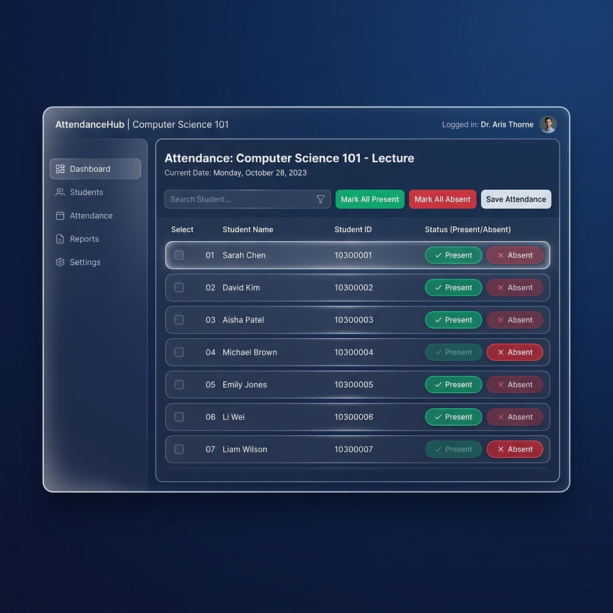
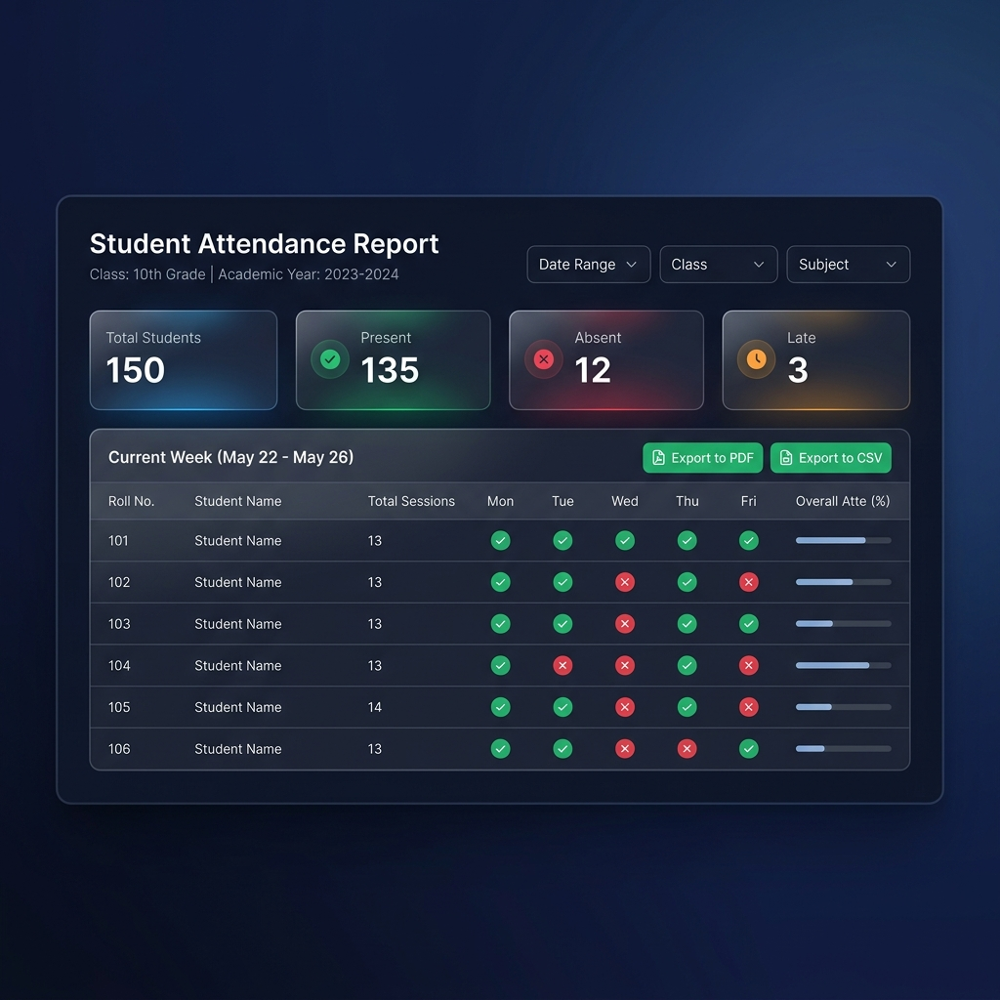

# Attendance Management System

A production-ready Student Attendance Management System built with **Django (Python)**. It features a high-fidelity **Dark Glassmorphic user interface**, robust database models with atomic transactions, a service layer architecture, custom forms validation, and complete test suites.

## Features & Corrections Implemented

-   **Dashboard Metrics**: Cards for *Total Students*, *Total Teachers*, *Present Today*, *Absent Today*, and a *Recent Activity Feed* logging additions, edits, deletions, and corrections.
-   **Student Directory**: Complete CRUD with pagination (25 records/page) and double-layer uniqueness validation for `(roll_number, class_name, section)` at both form and database levels.
-   **Teacher Directory**: Lightweight directory displaying subjects and contact information.
-   **UX-Optimized Marking**: Defaults all students to *Present* automatically. Supports bulk toggle controls (*Mark All Present*, *Mark All Absent*) and individual status toggles.
-   **Duplicate Protection**: Prevents duplicate attendance sheet creation for `(date, class, section)` and redirects to the edit form.
-   **Correction Audit Trail**: Tracks all attendance edits inside `AttendanceAuditLog` with mandatory reasons, documenting the *old status*, *new status*, *editor*, and *reason*.
-   **Empty Class Check**: Hard warning disables the "Save Attendance" button and alerts users if a selected class/section contains no students.
-   **Future Date Protection**: Prevents marking or editing attendance sheets for future dates.
-   **CSV Export Service**: Custom service exports reports directly to CSV.
-   **Print-Friendly View**: Uses custom `@media print` CSS selectors to generate exportable print layouts.
-   **Custom 404 & 500 Error Pages**: Theme-consistent frosted glass error layouts.
-   **Seeding Command**: Command to clear tables and auto-populate all demo data.

---

## Folder Structure

```text
attendance-system/
├─ manage.py
├─ requirements.txt
├─ README.md
├─ .env.example
├─ .gitignore
├─ Procfile
├─ runtime.txt
├─ static/
│  ├─ css/
│  │  └─ main.css
│  └─ js/
│     └─ main.js
├─ templates/
│  ├─ base.html
│  ├─ dashboard.html
│  ├─ 404.html
│  ├─ 500.html
│  ├─ registration/
│  │  └─ login.html
│  ├─ students/
│  │  ├─ student_list.html
│  │  ├─ student_form.html
│  │  └─ student_confirm_delete.html
│  ├─ teachers/
│  │  ├─ teacher_list.html
│  │  └─ teacher_form.html
│  └─ attendance/
│     ├─ mark_attendance.html
│     ├─ attendance_report.html
│     └─ attendance_edit.html
├─ attendance_app/
│  ├─ __init__.py
│  ├─ admin.py
│  ├─ apps.py
│  ├─ models.py
│  ├─ urls.py
│  ├─ views.py
│  ├─ forms.py
│  ├─ services.py
│  ├─ migrations/
│  └─ tests.py
└─ project_config/
   ├─ __init__.py
   ├─ settings.py
   ├─ urls.py
   ├─ asgi.py
   └─ wsgi.py
```

---

## Technical Details & Design Decisions

1.  **Architecture**: Follows clean-architecture principles by separating business logic (contained in `services.py`) from request/response handling (contained in Class-Based Views in `views.py`).
2.  **Transactions**: Attendance marking and updates are wrapped in `transaction.atomic()` to guarantee that no partial entries are created if an exception occurs.
3.  **Performance**: Database tables are indexed on query-heavy columns: `Student(class_name, section)`, `AttendanceSession(attendance_date)`, and `AttendanceEntry(status)` to make dashboard queries and reports faster.
4.  **No Framework CSS**: Developed using pure **Vanilla CSS Custom Variables** to build the Glassmorphic interface, ensuring zero external bloat and maximum rendering speeds.

---

## Setup & Local Run Instructions

### Prerequisites
- Python 3.11.x installed.

### Installation Steps

1.  **Extract and Open Project Directory**:
    ```bash
    cd student_attendance
    ```

2.  **Set Up Virtual Environment**:
    ```bash
    python -m venv venv
    ```

3.  **Activate Virtual Environment**:
    - **Windows (PowerShell)**:
      ```powershell
      .\venv\Scripts\Activate.ps1
      ```
    - **Windows (CMD)**:
      ```cmd
      .\venv\Scripts\activate.bat
      ```
    - **macOS/Linux**:
      ```bash
      source venv/bin/activate
      ```

4.  **Install Dependencies**:
    ```bash
    pip install -r requirements.txt
    ```

5.  **Create `.env` File**:
    Create a `.env` file in the root directory and copy the placeholder values:
    ```ini
    SECRET_KEY=django-insecure-dev-secret-key-99887766
    DEBUG=True
    ALLOWED_HOSTS=localhost,127.0.0.1
    DATABASE_URL=
    ```

6.  **Apply Database Migrations**:
    ```bash
    python manage.py migrate
    ```

7.  **Seed Database (Recommended)**:
    Run the custom seeding command to instantly populate the database with a default administrator account, 5 teachers, 30 students, and two days of historical attendance:
    ```bash
    python manage.py seed_data
    ```

8.  **Run Development Server**:
    ```bash
    python manage.py runserver
    ```
    Open your browser and navigate to `http://127.0.0.1:8000/`.

---

## Demo Credentials
- **Username**: `admin`
- **Password**: `adminpassword`

---

## Production Deployment Guide (e.g., Render)

### Environment Variables
For production hosting, configure the following variables in your dashboard settings:
-   `SECRET_KEY`: A secure random cryptographic hash.
-   `DEBUG`: Set to `False`.
-   `ALLOWED_HOSTS`: Your deployment domain name (e.g., `attendance-portal.onrender.com`).
-   `DATABASE_URL`: Connection string for PostgreSQL database.

### Build and Start Command
-   **Build Command**:
    ```bash
    pip install -r requirements.txt && python manage.py collectstatic --noinput && python manage.py migrate
    ```
-   **Start Command**:
    ```bash
    gunicorn project_config.wsgi:application
    ```

---

## Demo Video Recording Flow

If presenting the project, use this recommended order to demonstrate all features:
1.  **Login**: Log in using the seeded credentials (`admin` / `adminpassword`).
2.  **Dashboard**: Show metric cards and recent activity tracking.
3.  **Student Management**: Open Student Directory, add a student, search/filter, edit details, and verify deletion confirmations.
4.  **Teacher Listing**: Browse the lightweight faculty directory.
5.  **Mark Attendance**: Select class 10-A, date today. Click "Mark All Present", toggle a student "Absent", click "Save".
6.  **Duplicate Protection**: Try marking attendance for 10-A on today's date again. Verify warning alert pops up.
7.  **Attendance Report**: Select today's date, open the report, view summary widgets, and show printing style formatting.
8.  **Attendance Correction**: Open the edit page, change a student's status, add a mandatory reason, and save.
9.  **Audit Logs & Activity**: Open the dashboard to demonstrate that the activity log has updated. If desired, inspect database `AttendanceAuditLog` entries.
10. **CSV Export**: Click "Export CSV" on the report screen to verify the downloaded spreadsheet contains accurate listings.

---

## UI Screenshots (Frosted Glassmorphic Dark Mode)

### Dashboard View

*Frosted glass indicators, recent activity feed, and task cards.*

### Attendance Marking View

*UX toggles with pre-selected Present status and bulk controls.*

### Attendance Report View

*Date-wise present/absent summary table with CSV export options.*
